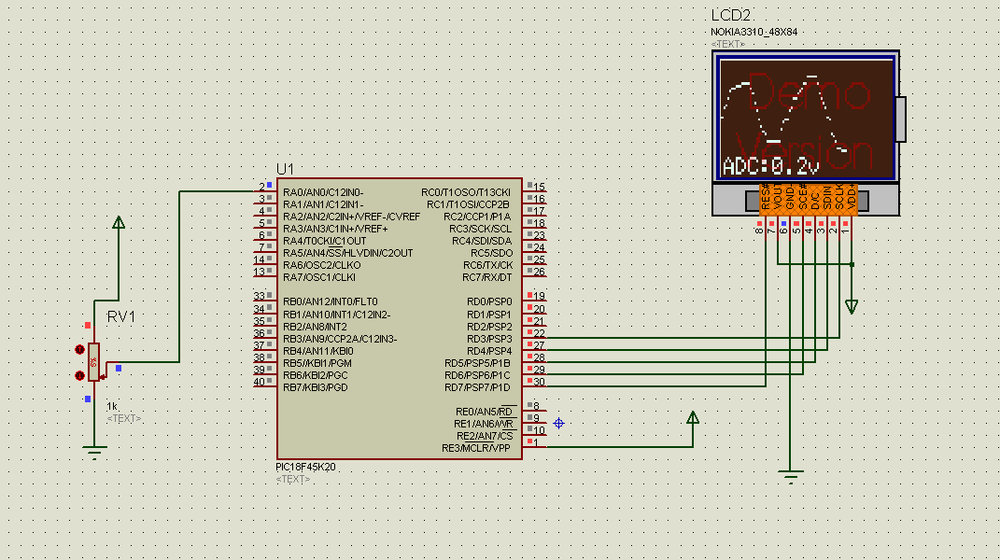

# pic18f45k20-ADC-5110
ADC obtains the voltage, draws a curve and displays the voltage value on Nokia5110

```
environment: MPLAB X IDE V4.01
             Proteus
             C18 

author: Hold Johnh ->HDU
```


